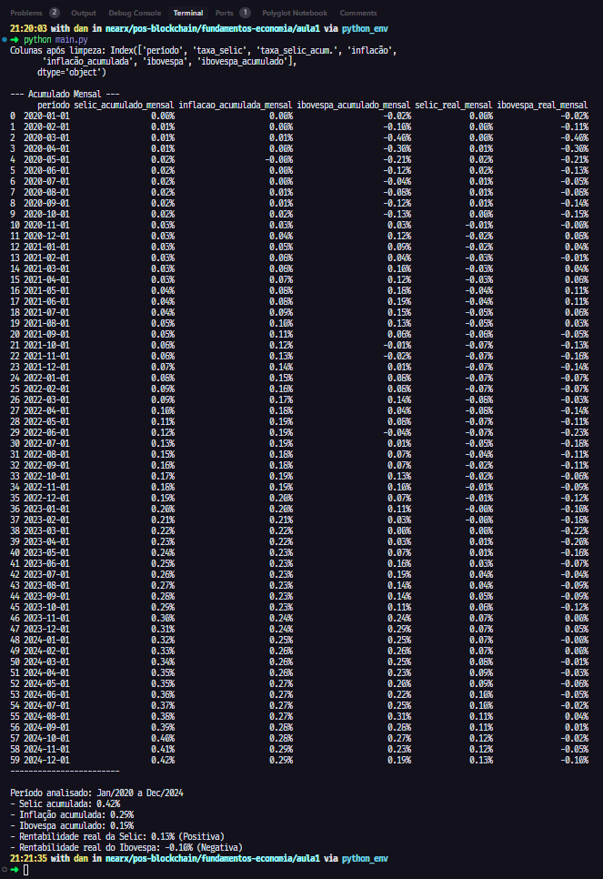

# Fundamentos de Economia - Análise de Mercado com Python

Este projeto contém um script Python (`main.py`) para analisar dados históricos de Selic, Inflação (IPCA) e Ibovespa com o objetivo de calcular rentabilidades acumuladas nominais e reais ao longo de um período.

## Base de Dados

O script utiliza dados da planilha `BASE DE DADOS ALUNOS - SELIC - INFLAÇÃO - IBOVESPA.xlsx`. Certifique-se de que este arquivo esteja na mesma pasta que o script `main.py` ou forneça o caminho correto no código.

## Requisitos

É necessário ter Python instalado, juntamente com a biblioteca `pandas`. Você pode instalar a dependência usando pip:

```bash
pip install pandas openpyxl
```

## Como Executar o Script

1. Clone o repositório para o seu ambiente local:

   ```bash
   git clone https://github.com/danielgorgonha/calculo-rentabilidade
   ```

2. Navegue até a pasta `calculo-rentabilidade` no terminal:

   ```bash
   cd calculo-rentabilidade
   ```

3. Execute o script Python:

   ```bash
   python main.py
   ```

## O Que o Script Faz

O script `main.py` realiza as seguintes operações:

1. Carrega os dados da planilha Excel.
2. Limpa e padroniza os nomes das colunas.
3. Converte as taxas percentuais para formato decimal.
4. **Calcula e exibe uma tabela com os valores acumulados (Selic, Inflação, Ibovespa) e a rentabilidade real (Selic vs Inflação, Ibovespa vs Inflação) mês a mês ao longo do período analisado.**
5. Calcula os valores acumulados totais para todo o período (Selic, Inflação, Ibovespa).
6. Calcula a rentabilidade real total para o período (Selic vs Inflação, Ibovespa vs Inflação).
7. Exibe os resultados totais no console, indicando se a rentabilidade real foi positiva ou negativa.

## Exemplo de Saída

Um exemplo da saída gerada pelo script pode ser encontrado na imagem:



## 📝 Licença

Este projeto está licenciado sob a licença MIT - veja o arquivo [LICENSE](LICENSE) para detalhes.

---

Feito com 💜 by <a href="https://www.linkedin.com/in/danielgorgonha/">Daniel R Gorgonha</a> :wave: